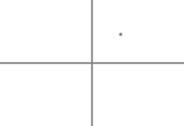
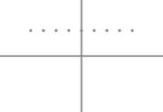
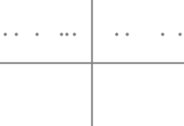
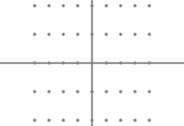
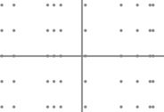
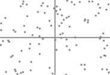
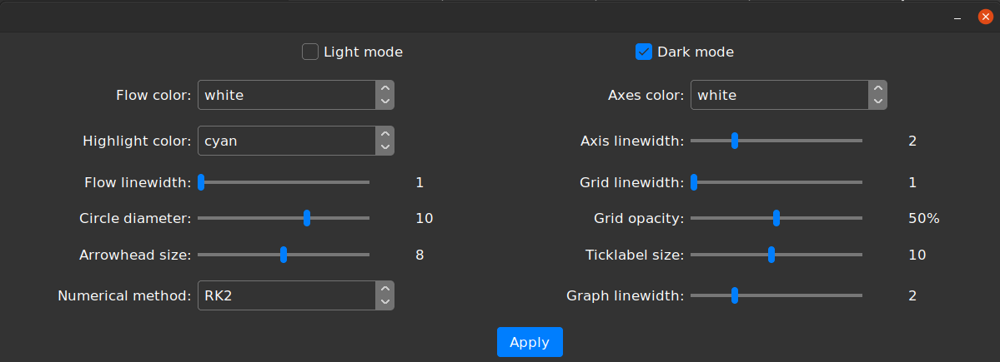

# planarFlow

***planarFlow*** is a Python/Tkinter application that aids in viewing and analyzing flows of planar dynamical 
systems.  


## Contents

- [Features](#features)
- [How to use](#how-to-use)
  - [Entering differential equations](#entering-differential-equations)
  - [Configuring plot](#configuring-plot)
  - [Adding graphs](#adding-graphs)
  - [Adding trajectories](#adding-trajectories)
  - [Animating](#animating)
  - [Saving PDFs](#saving-pdfs)
  - [Viewing time series](#viewing-time-series)
  - [Additional settings](#additional-settings)
- [Details](#details)
- [Required packages](#required-packages)
- [Warning](#warning)
- [License](#license)

## Features

With ***planarFlow***, you can explore the behavior of dynamical systems from several perspectives, including: 
- A phase portrait of the system. 
- The time series for a particular solution. 
- An animation of the flow of the system.

***planarFlow*** is suitable for multiple purposes, from visualizing the global behavior of systems to generating 
qualitative diagrams with minimal information. You can easily and quickly tailor ***planarFlow*** to suit your needs 
using features such as: 
- Specifying exact or randomly generated initial points. 
- Graphing equations and specifying their domains.
- Having control of the plotting environment.

## How to use

The user interface located on the left and comprises the following sections. 

### Entering differential equations

The top section is where the user sets the differential equations, $dx/dt$ and $dy/dt$, of the system. These equations 
should be functions of `t`, `x`, and `y` that follow NumPy syntax. 

The length of the time domain (by convention, all solutions start with initial time equal to zero) and the time-step 
used for numerical integration are set in the `tmax` and `Δt` entries, respectively. The `Set` button saves these 
settings and clears any solutions and graphed equations on the plot. 

### Configuring plot
Setting the domain of the plot is done by entering values for `xmin`, `xmax`, `ymin`, and `ymax`. For example, setting 
`xmin = a`, `xmax = b`, `ymin = c`, and `ymax = d` sets the viewing domain to $(a, b) \times (c, d)$. 

In most cases, setting values in all four entries above will yield a plot with unequal scaling in the $x$ and $y$ 
directions. To make the scaling equal in both directions, you can omit some of these entries. If both `ymin` and `ymax` 
are specified, then: 

- Setting `xmin` and leaving `xmax` empty will ensure that the left-most $x$ value is `xmin`. 
- Leaving `xmin` empty and setting `xmax` will ensure that the right-most $x$ value is `xmax`. 
- Leaving both `xmin` and `xmax` empty will center the $y$-axis in the middle of the plot. 

Equal scaling in both directions is maintained for each of the cases described above. This functionality also applies to 
`ymin` and `ymax` if `xmin` and `xmax` are both specified beforehand. 

The addition of grid lines, tick labels, and their spacing (`Δx` and `Δy`) are also managed here. To completely remove 
tick marks, leave `Δx` and `Δy` empty. Changes to the plot settings are reflected once the `Configure Plot` button
is pressed. 

### Adding graphs

Expressions of the form $y = f(x)$, $x = f(y)$, and $f(x, y) = C$ can be displayed alongside solutions to the
differential equations. These expressions must also be compatible with NumPy syntax. To plot the parabola $y = x^2$, 
one should enter `y = x**2` into the `Equations:` entry. Furthermore, to plot a circle of radius $2$, one should enter 
`x**2 + y**2 = 4`. 

Color codes can also be entered following a comma. For example, entering `x**2 + y**2 = 4, b` plots a 
blue circle of radius $2$. Below is a list of available colors and their corresponding codes. 

| Color | Code | Color   | Code |
|-------|------|---------|------|
| blue  | b    | magenta | m    | 
| green | g    | yellow  | y    |
| red   | r    | black   | k    |
| cyan  | c    | white   | w    |

By default, the equation is plotted over the entire domain $(x_{min}, x_{max}) \times (y_{min}, y_{max})$. Domains of 
the form `(a, b)` can be specified for $x$ and $y$ (`a` and `b` can be `-inf` and `inf`, respectively). For example, 
setting the $x$-domain to `(0, inf)` plots an equation to the right of the $y$-axis only. A graph is drawn once the 
`Plot` button is pressed. 

### Adding trajectories

Trajectories are added by entering initial conditions to `x0` and `y0`. The options include single initial points, 
a meshgrid-like set of initial points, or randomly generated initial points, depending on the type of arguments to `x0`
and `y0`. Options include: 

- A single value.
- An array of equally spaced values, entered as`(start, end, increment)`.
- An array of 10 randomly generated values between `xmin` and `xmax` or `ymin` and `ymax`, entered as `rand`. 

Below are some examples of different combinations of formats for `x0` and `y0`. 

| `x0`        | `y0`       | Points                          |
|-------------|------------|---------------------------------|
| 0.5         | 0.5        |  |
| -1, 1, 0.25 | 0.5        |  |
| rand        | 0.5        |  |
| -1, 1, 0.25 | -1, 1, 0.5 |  |
| rand        | -1, 1, 0.5 |  |
| rand        | rand       |  |

The solutions with the generated initial conditions are computed and displayed once the `Add` button is pressed. More 
solutions can be added to those previously computed and displayed.


### Animating

Pressing the `Animate Flow` button opens a new fullscreen window containing an animation of the dynamical system's flow 
over the entire time domain. See an example [here](readme_images/animation_example.gif). 

### Viewing time series

Each solution is highlighted and its initial conditions displayed whenever the mouse hovers over its starting location.
When clicked, a new window showing the time series for $x(t)$ and $y(t)$ will appear.


### Saving PDFs

Once you are satisfied with the visualization of the dynamical system, you can save a PDF of the plot with `ctrl + s`. 
This only applies to the main plot; the individual time series and the animation cannot be saved with `ctrl + s`.  

***Note***: There are some glitches when opening the file dialog in Ubuntu, in particular the background and text color 
of the directory list is the same unless clicked on. This issue is not present on Windows.


### Additional settings

Additional settings can be accessed through the  button.



Colors, line widths, and other visual aspects can be tweaked here depending on the end goal of the user. For 
[example](readme_images/qualitative_example.png), a stripped-down plot configuration can be useful for 
more qualitative diagrams. There is also a [light mode](readme_images/lightmode.png) for ***planarFlow***. 


## Details 

***planarFlow*** uses Matplotlib for all plotting and animations. LineCollections and PatchCollections are used to plot 
numerous artists in an efficient manner. 

The differential equations and graph equations are converted to lambda functions using SymPy 
(see the **Warning** below). These functions are evaluated with NumPy, and the solutions are then computed and stored as 
NumPy arrays. 

This application uses [rdbende](https://github.com/rdbende)'s 
[Azure](https://github.com/rdbende/Azure-ttk-theme/tree/gif-based) theme. Note that the 
[light mode](readme_images/lightmode.png) uses a different color configuration, therefore selected GIFs called by ttk are 
modified to match.

Available numerical methods include 2nd- and 4th-order Runge-Kutta, as well as Euler's method (do not use unless
demonstrating its pitfalls). ***planarFlow*** was designed as an educational resource rather than a tool for scientific
research. If desired, more robust and stable methods can be implemented in the `lib/numerical_methods` file. Additional 
functions should have the same inputs and return order for $t$, $x$, and $y$ values, and will automatically be added to 
the options listed in the settings window. Below is an example using 
[`solve_ivp`](https://docs.scipy.org/doc/scipy/reference/generated/scipy.integrate.solve_ivp.html) from SciPy: 
```python
from scipy.integrate import solve_ivp
```
...

```python
def RK45(dxdt, dydt, x0, y0, tmax, dt):

    dXdt = lambda t, X: [dxdt(t, X[0], X[1]), dydt(t, X[0], X[1])]
    tt = np.arange(0., tmax + dt, dt)

    solution = solve_ivp(dXdt, [0, tmax], [x0, y0], 'RK45', t_eval=tt)

    xx = solution.y[0]
    yy = solution.y[1]

    return tt, xx, yy
```

***planarFlow*** can also be used to generate [direction field diagrams](readme_images/directionfield_example.png). To 
do this, set `tmax` and `dt` to small and equal values (e.g. `0.02`), and adjust the circle diameters and arrowhead 
sizes. 

## Required Packages 

***planarFlow*** requires Matplotlib, NumPy, and SymPy to be installed. 

## Warning

***planarFlow*** uses SymPy's [`lambdify`](https://docs.sympy.org/latest/modules/utilities/lambdify.html) 
function to convert user arguments to lambda functions. This is of particular concern since `lambdify` uses `eval` and 
the inputs are not sanitized. 

## License

planarFlow is licensed under [GPLv3](https://www.gnu.org/licenses/gpl-3.0.en.html). 
